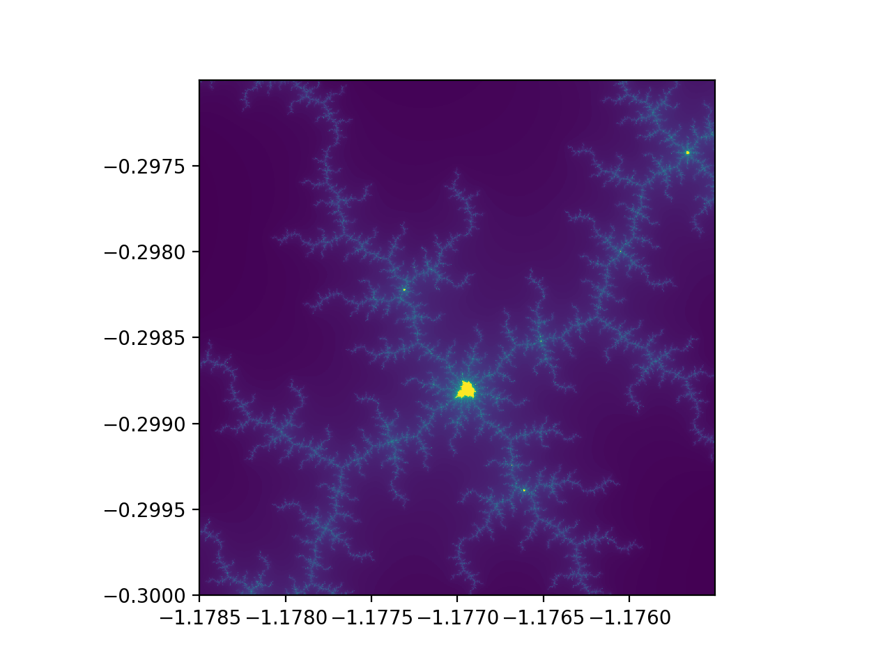

# Mandelbrot Set Generator

This code generates the Mandelbrot set using OpenCL. At present it is quite basic.

## Compilation instructions
To compile the code, type `make linux` for a linux host and `make apple` for a MacOS host. 

## Options
Within `mandelbrot.c` there are parameters `PLATFORMNUM` and `DEVICENUM`. These are set to the OpenCL platform and device numbers you wish the code to use.

The parameters `XMIN`, `XMAX`, `YMIN` and `YMAX` define the extent of the image to be calculated.

## Running the code
Once compiled, run the code as normal (e.g. `$ ./mandelbrot`). You should get output similar to:
```
OpenCL platform: Apple
OpenCL device: AMD Radeon R9 M370X Compute Engine
Executing the kernel... Done!
```
Where the specific platform and device info printed will depend on your hardware.

The results can be displayed by running `display.py`. You should get an image like the below image.

